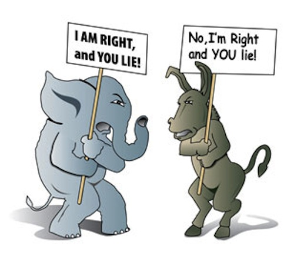

```{r, globalsettings, echo=FALSE, warning=FALSE, results='hide'}
library(knitr)

knitr::opts_chunk$set(echo = TRUE)
opts_chunk$set(tidy.opts=list(width.cutoff=100),tidy=TRUE, warning = FALSE, message = FALSE,comment = "#>", cache=TRUE, class.source=c("test"), class.output=c("test2"))
options(width = 100)
rgl::setupKnitr()


colorize <- function(x, color) {sprintf("<span style='color: %s;'>%s</span>", color, x) }

```

```{r klippy, echo=FALSE, include=TRUE}
klippy::klippy(position = c('top', 'right'))
#klippy::klippy(color = 'darkred')
#klippy::klippy(tooltip_message = 'Click to copy', tooltip_success = 'Done')
```


----

:::::::::::::: {.columns}
::: {.column width="50%"}

# **Your own lab journal**
### BIGSSS-CSS: Segregation-Polarisation
Last compiled on `r format(Sys.time(), '%B, %Y')`

<br>

----
  
Students of the BIGSSS Summer School can fork this repository. Using this, they can ...


:::
::: {.column width="50%"}





:::
::::::::::::::


## How to use

1. fork the repository for this website and follow instructions on `README` to get started [here](https://github.com/robfranken/exampe_repo_bigsss).  

2. Journal your analyses, by editing the `Journal.Rmd.`

3. (...)


Use the top menu to navigate to ...

----


